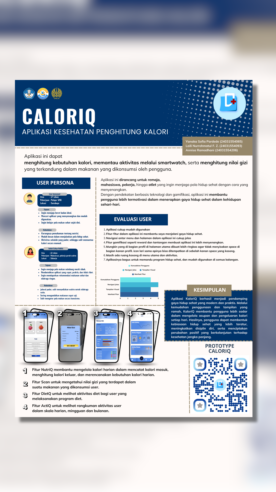

# KALORIQ — Smart Calorie & Healthy Lifestyle Monitoring

<p align="center">
  
</p>

<p align="center">
  <strong>UI/UX Design Case Study for a Smart Health and Calorie Monitoring Application</strong>
</p>

<p align="center">
  <a href="https://www.figma.com/proto/JCilSJwUD1J55Dm6YSkcJh/CaloriQ?node-id=279-150&starting-point-node-id=279%3A150&t=eF7eDMePPJaGYAn2-1">
    🔗 View Interactive Prototype on Figma
  </a>
</p>

---

## 📌 Project Overview

**KALORIQ** is a UI/UX design project that presents a smart health and calorie monitoring application designed to support users in managing their calorie intake, nutrition, physical activity, and healthy lifestyle habits through an integrated digital platform.

The concept was developed from the understanding that maintaining a healthy lifestyle involves more than simply calculating calories. Users also need accessible nutritional information, personalized recommendations, meal planning, activity monitoring, progress tracking, and motivation to maintain healthy habits consistently.

KALORIQ brings these needs together through an integrated application experience that combines nutrition monitoring, calorie management, physical activity, personalized recommendations, consultation, challenges, and reward-based features.

This project focuses on the **User Experience (UX) research and User Interface (UI) design process**, beginning with user research and identification of user needs, followed by persona development, storyboard creation, contextual modeling, UX goal definition, interface design, and interactive prototyping.

---

## 🎯 Project Objectives

The main objectives of KALORIQ are to:

- Help users monitor their daily calorie and nutritional intake.
- Support users in developing and maintaining healthier lifestyle habits.
- Provide accessible nutrition and health-related information.
- Provide personalized food and nutrition recommendations.
- Help users plan their meals according to their needs.
- Support physical activity monitoring.
- Help users monitor their progress.
- Provide convenient access to dietary and nutrition-related consultation.
- Increase user motivation through challenges, points, vouchers, and rewards.
- Integrate multiple healthy-lifestyle management functions into one application.

---

## 🔎 UX Research

The design process began with UX research to understand the needs, habits, difficulties, and expectations of potential users.

### Research Method

A **quantitative research approach** was conducted using an online questionnaire.

The questionnaire collected responses from **48 respondents** representing potential users of a digital health and lifestyle application.

The research targeted smartphone and internet users who have an interest in health, nutrition, physical activity, or maintaining a healthier lifestyle.

### Usability Aspects

The research considered several usability dimensions:

- **Effectiveness** — whether users can accomplish their intended goals.
- **Efficiency** — how easily users can complete tasks.
- **Safety** — whether the application provides a comfortable and reliable experience.
- **Utility** — whether the features provide meaningful value to users.
- **Learnability** — how easily new users can understand the application.
- **Memorability** — how easily users can remember how to use the application.
- **Satisfaction** — how satisfied users are with the overall experience.

The research findings were used as a foundation for identifying user needs, understanding pain points, and defining the direction of the KALORIQ design.

---

## 👤 User Needs

The UX research and analysis identified several needs that the application should address.

Users need:

- Easy access to calorie information.
- Easy access to nutritional information.
- A convenient way to monitor daily food consumption.
- Personalized food recommendations.
- Meal planning support.
- Physical activity monitoring.
- Progress tracking.
- Food and nutrition analysis.
- Accessible dietary guidance.
- Nutrition-related consultation.
- Motivation to maintain healthy habits.
- A more integrated way to manage different aspects of a healthy lifestyle.

These needs were translated into the features and design structure of KALORIQ.

---

## ⚠️ User Pain Points

The design process also considered several potential difficulties experienced by users when managing their health and lifestyle.

The identified pain points include:

- Difficulty monitoring daily calorie intake.
- Difficulty understanding nutritional information.
- Difficulty choosing food according to individual nutritional needs.
- Lack of personalized food recommendations.
- Difficulty maintaining consistent healthy habits.
- Difficulty planning meals.
- Limited motivation to continue healthy routines.
- The need to use different tools or services for different health-related activities.

KALORIQ was designed to address these challenges by bringing related functions together within a single digital platform.

---

## 🧑‍💻 User-Centered Design Process

The KALORIQ design process followed a user-centered approach:

```text
UX Research
     ↓
User Needs & Pain Points
     ↓
User Persona
     ↓
Storyboard
     ↓
Contextual Model
     ↓
UX Goals
     ↓
Information Architecture
     ↓
UI Design
     ↓
Interactive Prototype
